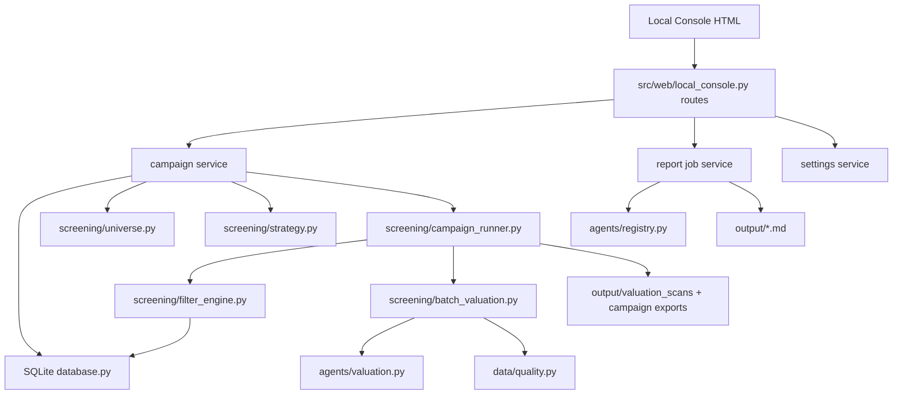

# Design: Quarterly Scan Screening Workbench

## 1. Context

### 1.1 PRD

来源 PRD:

```text
docs/plans/2026-07-17-quarterly-scan-screening-prd.md
```

### 1.2 Current Baseline

当前已存在能力：

| 能力 | 当前实现 |
|---|---|
| 本地控制台 | `src/web/local_console.py`，标准库 HTTP server，服务端 HTML |
| 股票池 | `src/screening/universe.py`，优先读取 SQLite `stock_universe` |
| A 股股票池刷新 | Tushare `stock_basic`，写入 `stock_universe` |
| 估值扫描 job | `src/screening/jobs.py`，JSON 文件持久化到 `output/valuation_jobs` |
| 批量估值 | `src/screening/batch_valuation.py::run_batch_valuation` |
| 估值扫描结果 | `output/valuation_scans/{scan_id}.json/csv` |
| 报告生成 | `src/agents/registry.py::run_all_agents` |
| report job | `src/web/local_console.py` 内存状态 + `output/report_jobs/latest.json` |
| 设置保存 | `src/web/local_console.py::_write_env_updates`，带 `.env.backup-*` |
| 健康检查 | `src/web/health.py` |

### 1.3 Design Goals

- 不推翻现有 job/scan/report 输出，而是增加 campaign 层。
- SQLite 作为 campaign 状态的主存储；JSON/CSV 继续作为输出和审计文件。
- 前端继续轻量，本地 HTML + CSS + 少量 JS。
- 扫描执行单线程，状态每只 ticker 落盘，保证重启恢复。
- 筛选策略、规则评估、估值结果、失败原因全部结构化。

## 2. Architecture

### 2.1 Logical Architecture



### 2.2 New Backend Modules

| Module | Responsibility |
|---|---|
| `src/screening/models.py` | Enums/dataclasses for campaign, batch, rule evaluation, filter result, failures |
| `src/screening/campaigns.py` | Campaign CRUD, creation, snapshot, status aggregation, export metadata |
| `src/screening/campaign_runner.py` | Long-running runner, control flag handling, resume modes |
| `src/screening/strategy.py` | Load/validate screening strategy, create immutable snapshot |
| `src/screening/filter_engine.py` | Execute L0/L1/red_flag rules and produce rule evaluations |
| `src/screening/failures.py` | Normalize exceptions and missing data to `failure_type` |
| `src/screening/report_jobs.py` | Persistent per-ticker report jobs and row button state |
| `src/web/campaign_pages.py` | Optional render helpers if `local_console.py` grows too much |

### 2.3 Existing Modules To Extend

| Module | Change |
|---|---|
| `src/data/database.py` | Add schema and CRUD for campaign, rule evaluations, master results, report jobs, app settings |
| `src/screening/jobs.py` | Keep legacy job APIs; add bridge from campaign runner to job JSON for audit compatibility |
| `src/screening/batch_valuation.py` | Extend `ValuationSnapshot` with filter fields; add `run_screened_batch_valuation()` wrapper |
| `src/web/local_console.py` | Add campaign pages, actions, status JSON endpoints, report row state, toggle controls |
| `src/web/health.py` | Expose latest health snapshot to failure panel |

## 3. Data Model

### 3.1 Enums

```python
CampaignStatus = Literal[
    "created",
    "queued",
    "running",
    "pausing",
    "paused",
    "stopping",
    "stopped",
    "failed",
    "completed",
]

BatchStatus = Literal["pending", "running", "paused", "failed", "completed", "skipped"]

CampaignControlFlag = Literal["none", "pause_requested", "stop_requested"]

ResumeMode = Literal["continue_last", "restart_new", "scan_remaining", "retry_failed"]

MarketScope = Literal["a_share", "hk", "a_share_hk", "watchlist"]

FilterLayer = Literal["l0", "l1", "red_flag", "valuation"]

RuleResult = Literal["pass", "reject", "missing", "manual_review", "skipped"]

FilterStatus = Literal[
    "passed",
    "rejected_l0",
    "rejected_l1",
    "rejected_red_flag",
    "rejected_missing_data",
    "manual_review",
    "failed",
]

ScanStatus = Literal["pending", "running", "success", "failed", "skipped"]

ReportJobStatus = Literal["not_started", "queued", "running", "completed", "failed"]

FailureType = Literal[
    "data_source_timeout",
    "tushare_auth_failed",
    "llm_auth_failed",
    "llm_quota_failed",
    "local_db_locked",
    "report_file_missing",
    "screening_data_missing",
    "strategy_config_invalid",
    "unknown_error",
]
```

### 3.2 SQLite Tables

#### `scan_campaigns`

Campaign header and resume cursor.

```sql
CREATE TABLE IF NOT EXISTS scan_campaigns (
    campaign_id TEXT PRIMARY KEY,
    campaign_name TEXT NOT NULL,
    quarter TEXT NOT NULL,
    market_scope TEXT NOT NULL,
    strategy_snapshot_id TEXT NOT NULL,
    status TEXT NOT NULL,
    control_flag TEXT DEFAULT 'none',
    resume_mode TEXT DEFAULT 'continue_last',
    batch_size INTEGER NOT NULL,
    total_count INTEGER DEFAULT 0,
    completed_count INTEGER DEFAULT 0,
    failed_count INTEGER DEFAULT 0,
    skipped_count INTEGER DEFAULT 0,
    rejected_count INTEGER DEFAULT 0,
    remaining_count INTEGER DEFAULT 0,
    current_batch_id TEXT,
    current_ticker TEXT,
    cursor_index INTEGER DEFAULT 0,
    last_completed_ticker TEXT,
    next_ticker TEXT,
    consecutive_failure_count INTEGER DEFAULT 0,
    max_consecutive_failures INTEGER DEFAULT 10,
    scan_use_llm INTEGER DEFAULT 0,
    scan_refresh_data INTEGER DEFAULT 0,
    skip_scanned INTEGER DEFAULT 1,
    force_rescan INTEGER DEFAULT 0,
    result_json_path TEXT,
    result_csv_path TEXT,
    created_at TEXT DEFAULT (datetime('now')),
    started_at TEXT,
    updated_at TEXT DEFAULT (datetime('now')),
    finished_at TEXT
);
```

Indexes:

```sql
CREATE INDEX IF NOT EXISTS idx_scan_campaigns_status ON scan_campaigns(status, updated_at);
CREATE INDEX IF NOT EXISTS idx_scan_campaigns_quarter ON scan_campaigns(quarter, market_scope);
```

#### `scan_batches`

Batch-level progress.

```sql
CREATE TABLE IF NOT EXISTS scan_batches (
    batch_id TEXT PRIMARY KEY,
    campaign_id TEXT NOT NULL,
    batch_index INTEGER NOT NULL,
    start_index INTEGER NOT NULL,
    end_index INTEGER NOT NULL,
    status TEXT NOT NULL,
    total_count INTEGER DEFAULT 0,
    completed_count INTEGER DEFAULT 0,
    failed_count INTEGER DEFAULT 0,
    skipped_count INTEGER DEFAULT 0,
    started_at TEXT,
    updated_at TEXT DEFAULT (datetime('now')),
    finished_at TEXT,
    FOREIGN KEY(campaign_id) REFERENCES scan_campaigns(campaign_id),
    UNIQUE(campaign_id, batch_index)
);
```

#### `scan_campaign_items`

This is the immutable `universe_snapshot` plus per-ticker state.

```sql
CREATE TABLE IF NOT EXISTS scan_campaign_items (
    id INTEGER PRIMARY KEY AUTOINCREMENT,
    campaign_id TEXT NOT NULL,
    batch_id TEXT NOT NULL,
    item_index INTEGER NOT NULL,
    ticker TEXT NOT NULL,
    name TEXT,
    market TEXT NOT NULL,
    sector TEXT,
    board TEXT,
    exchange TEXT,
    snapshot_json TEXT,
    scan_status TEXT DEFAULT 'pending',
    filter_status TEXT,
    filter_layer TEXT,
    reject_reason TEXT,
    current_stage TEXT,
    error TEXT,
    started_at TEXT,
    scanned_at TEXT,
    updated_at TEXT DEFAULT (datetime('now')),
    FOREIGN KEY(campaign_id) REFERENCES scan_campaigns(campaign_id),
    FOREIGN KEY(batch_id) REFERENCES scan_batches(batch_id),
    UNIQUE(campaign_id, ticker)
);
```

Indexes:

```sql
CREATE INDEX IF NOT EXISTS idx_campaign_items_cursor ON scan_campaign_items(campaign_id, item_index);
CREATE INDEX IF NOT EXISTS idx_campaign_items_status ON scan_campaign_items(campaign_id, scan_status);
CREATE INDEX IF NOT EXISTS idx_campaign_items_filter ON scan_campaign_items(campaign_id, filter_status, filter_layer);
```

#### `screening_strategy_snapshots`

Immutable strategy copy for each campaign.

```sql
CREATE TABLE IF NOT EXISTS screening_strategy_snapshots (
    strategy_snapshot_id TEXT PRIMARY KEY,
    strategy_id TEXT NOT NULL,
    strategy_name TEXT NOT NULL,
    strategy_version TEXT NOT NULL,
    source_path TEXT,
    config_hash TEXT NOT NULL,
    config_json TEXT NOT NULL,
    validation_status TEXT NOT NULL,
    validation_errors_json TEXT,
    created_at TEXT DEFAULT (datetime('now'))
);
```

#### `scan_rule_evaluations`

Ticker-level rule trace.

```sql
CREATE TABLE IF NOT EXISTS scan_rule_evaluations (
    id INTEGER PRIMARY KEY AUTOINCREMENT,
    campaign_id TEXT NOT NULL,
    ticker TEXT NOT NULL,
    rule_id TEXT NOT NULL,
    rule_layer TEXT NOT NULL,
    rule_name TEXT NOT NULL,
    enabled INTEGER DEFAULT 1,
    input_value TEXT,
    threshold_value TEXT,
    result TEXT NOT NULL,
    severity TEXT NOT NULL,
    reason TEXT,
    data_source TEXT,
    period_range TEXT,
    created_at TEXT DEFAULT (datetime('now')),
    FOREIGN KEY(campaign_id) REFERENCES scan_campaigns(campaign_id)
);
```

Indexes:

```sql
CREATE INDEX IF NOT EXISTS idx_rule_eval_campaign_rule ON scan_rule_evaluations(campaign_id, rule_id, result);
CREATE INDEX IF NOT EXISTS idx_rule_eval_ticker ON scan_rule_evaluations(campaign_id, ticker);
```

#### `scan_master_results`

One latest row per ticker per campaign. Re-scan overwrites this row while batch detail remains in item/rule history.

```sql
CREATE TABLE IF NOT EXISTS scan_master_results (
    campaign_id TEXT NOT NULL,
    ticker TEXT NOT NULL,
    name TEXT,
    market TEXT NOT NULL,
    sector TEXT,
    filter_status TEXT,
    filter_layer TEXT,
    reject_reason TEXT,
    failed_rules_json TEXT,
    missing_rules_json TEXT,
    rule_score REAL,
    current_price REAL,
    intrinsic_value REAL,
    margin_of_safety_pct REAL,
    action TEXT,
    confidence REAL,
    quality_score REAL,
    data_completeness REAL,
    scan_status TEXT NOT NULL,
    batch_id TEXT,
    valuation_json TEXT,
    error TEXT,
    scanned_at TEXT,
    updated_at TEXT DEFAULT (datetime('now')),
    PRIMARY KEY(campaign_id, ticker),
    FOREIGN KEY(campaign_id) REFERENCES scan_campaigns(campaign_id)
);
```

#### `scan_failures`

Normalized failure records.

```sql
CREATE TABLE IF NOT EXISTS scan_failures (
    id INTEGER PRIMARY KEY AUTOINCREMENT,
    campaign_id TEXT,
    batch_id TEXT,
    ticker TEXT,
    report_job_id TEXT,
    failure_type TEXT NOT NULL,
    failure_scope TEXT NOT NULL,
    retryable INTEGER DEFAULT 0,
    user_action TEXT,
    raw_error TEXT,
    created_at TEXT DEFAULT (datetime('now'))
);
```

#### `report_jobs`

Persistent per-ticker report job registry. Existing `output/report_jobs/latest.json` remains as a compatibility mirror for latest job.

```sql
CREATE TABLE IF NOT EXISTS report_jobs (
    report_job_id TEXT PRIMARY KEY,
    ticker TEXT NOT NULL,
    market TEXT NOT NULL,
    name TEXT,
    sector TEXT,
    source_scan_id TEXT,
    source_campaign_id TEXT,
    source_strategy_id TEXT,
    status TEXT NOT NULL,
    progress_pct INTEGER DEFAULT 0,
    stage TEXT,
    message TEXT,
    report_path TEXT,
    report_url TEXT,
    failure_type TEXT,
    error TEXT,
    events_json TEXT,
    created_at TEXT DEFAULT (datetime('now')),
    started_at TEXT,
    updated_at TEXT DEFAULT (datetime('now')),
    finished_at TEXT
);
```

Indexes:

```sql
CREATE INDEX IF NOT EXISTS idx_report_jobs_ticker ON report_jobs(ticker, updated_at);
CREATE INDEX IF NOT EXISTS idx_report_jobs_campaign ON report_jobs(source_campaign_id, ticker);
```

#### `app_settings`

Optional persistent setting snapshots. `.env` remains source for process env and secrets.

```sql
CREATE TABLE IF NOT EXISTS app_settings (
    config_key TEXT PRIMARY KEY,
    config_value TEXT NOT NULL,
    value_type TEXT NOT NULL,
    effective_scope TEXT NOT NULL,
    saved_at TEXT DEFAULT (datetime('now'))
);
```

### 3.3 JSON Output Compatibility

Existing outputs remain:

```text
output/valuation_jobs/{job_id}.json
output/valuation_scans/{scan_id}.json
output/valuation_scans/{scan_id}.csv
output/report_jobs/latest.json
output/*.md
```

New campaign exports:

```text
output/scan_campaigns/{campaign_id}/master_result.json
output/scan_campaigns/{campaign_id}/master_result.csv
output/scan_campaigns/{campaign_id}/candidates.csv
output/scan_campaigns/{campaign_id}/rejected_details.csv
output/scan_campaigns/{campaign_id}/failures.csv
```

`valuation_scans` remains the latest scan table consumed by current homepage. Campaign completion writes a valuation scan payload with `metadata.campaign_id`.

## 4. Backend Flows

### 4.1 Create Campaign

Input:

```json
{
  "campaign_name": "2026Q3 A股季度扫描",
  "quarter": "2026Q3",
  "market_scope": "a_share",
  "batch_size": 100,
  "strategy_id": "buffett_quality_v1",
  "resume_mode": "restart_new",
  "scan_use_llm": false,
  "scan_refresh_data": false,
  "skip_scanned": true
}
```

Steps:

1. Validate `batch_size <= 500`.
2. Validate data source prerequisites:
   - `a_share` requires local `stock_universe` not empty, or Tushare config available for refresh.
   - `hk` can degrade to empty state with actionable message if AKShare disabled.
3. Load universe via `load_universe()`.
4. Persist `universe_snapshot` rows into `scan_campaign_items`.
5. Load and validate screening strategy.
6. Persist `screening_strategy_snapshots`.
7. Create `scan_campaigns` row.
8. Split snapshot into `scan_batches`.
9. Return campaign summary within 3 seconds.

Pseudo:

```python
def create_campaign(request: CampaignCreateRequest) -> CampaignSummary:
    if request.batch_size > 500:
        raise ValidationError("单批最多 500 只")
    universe = load_universe(...)
    if not universe:
        raise ValidationError("股票池为空，请先刷新股票库")
    snapshot_id = create_strategy_snapshot(request.strategy_id)
    campaign_id = new_campaign_id(request.quarter, request.market_scope)
    with database.transaction():
        insert_campaign(...)
        insert_campaign_items(campaign_id, universe)
        insert_batches(campaign_id, batch_size=request.batch_size)
    return get_campaign_summary(campaign_id)
```

### 4.2 Run Campaign

The runner is single-threaded per campaign. The process may host only one active campaign runner in MVP.

Loop:

```python
for item in iter_items_by_resume_mode(campaign_id, resume_mode):
    mark_item_running(item, stage="l0")
    filter_result = evaluate_filters(campaign_id, item)
    save_rule_evaluations(filter_result.evaluations)

    if filter_result.blocks_valuation:
        upsert_master_result(filter_only_row)
        mark_item_done(scan_status="skipped", filter_status=filter_result.status)
    else:
        valuation = run_batch_valuation(...)
        upsert_master_result(merged_filter_and_valuation_row)
        mark_item_done(scan_status="success")

    update_campaign_counts()
    export_incremental_master_result()
    if should_pause_or_stop(campaign_id):
        transition_controlled_stop()
        break
```

### 4.3 Resume Modes

| Mode | Behavior |
|---|---|
| `continue_last` | Continue from `next_ticker`; skip completed and skipped rows |
| `scan_remaining` | Scan all `pending` or `running` stale items |
| `retry_failed` | Scan only rows with `scan_status = failed` |
| `restart_new` | Create a new campaign with fresh snapshot; old campaign untouched |

### 4.4 Control Actions

Routes:

```text
POST /actions/campaigns/{campaign_id}/pause
POST /actions/campaigns/{campaign_id}/stop
POST /actions/campaigns/{campaign_id}/resume
POST /actions/campaigns/{campaign_id}/retry-failed
```

Implementation:

- Pause sets `control_flag = pause_requested`, status remains `running` until current ticker finishes.
- Stop sets `control_flag = stop_requested`, status remains `running` until current ticker finishes or per-ticker timeout.
- Runner checks flag after every ticker.
- Resume clears `control_flag`, sets status `queued`, starts background thread.

### 4.5 Failure Normalization

`src/screening/failures.py` maps raw exceptions to displayable failures:

```python
def classify_failure(error: Exception | str, *, scope: str) -> FailureRecord:
    text = str(error).lower()
    if "timeout" in text:
        return FailureRecord("data_source_timeout", scope, True, "重试失败项", text)
    if "tushare" in text and ("auth" in text or "token" in text):
        return FailureRecord("tushare_auth_failed", scope, False, "打开配置", text)
    if "quota" in text or "insufficient_quota" in text:
        return FailureRecord("llm_quota_failed", scope, False, "关闭 LLM 或更换 Key", text)
    if "database is locked" in text:
        return FailureRecord("local_db_locked", scope, True, "稍后重试", text)
    return FailureRecord("unknown_error", scope, True, "查看详情", text)
```

连续失败:

- Runner increments `consecutive_failure_count` on ticker-level failed.
- Any success, filter reject, or manual review resets it to 0.
- If count reaches `max_consecutive_failures` default 10, status becomes `paused`, failure scope is `campaign`.

## 5. Screening Strategy Design

### 5.1 Strategy Source

Read from `config/screening_rules.yaml` without modifying it.

If the existing file does not yet contain L0/L1/red_flag shape, `src/screening/strategy.py` returns an in-code default strategy and marks source as `builtin_default`.

The strategy snapshot stores:

```json
{
  "strategy_id": "buffett_quality_v1",
  "strategy_name": "巴菲特质量价值筛选",
  "strategy_version": "2026.07.17",
  "layers": [
    {
      "layer": "l0",
      "rules": [
        {
          "rule_id": "l0_non_st",
          "rule_name": "非 ST",
          "enabled": true,
          "threshold": {"name_excludes": ["ST", "*ST", "退"]},
          "severity": "hard",
          "missing_policy": "manual_review",
          "data_source": "stock_universe.name"
        }
      ]
    }
  ]
}
```

### 5.2 Rule Evaluator Contract

```python
@dataclass
class RuleEvaluation:
    rule_id: str
    rule_layer: FilterLayer
    rule_name: str
    enabled: bool
    input_value: str | None
    threshold_value: str | None
    result: RuleResult
    severity: Literal["hard", "warning", "info"]
    reason: str
    data_source: str
    period_range: str | None = None

@dataclass
class FilterResult:
    ticker: str
    filter_status: FilterStatus
    filter_layer: FilterLayer | None
    reject_reason: str
    failed_rules: list[str]
    missing_rules: list[str]
    rule_score: float
    evaluations: list[RuleEvaluation]

    @property
    def blocks_valuation(self) -> bool:
        return self.filter_status in {
            "rejected_l0",
            "rejected_l1",
            "rejected_red_flag",
            "rejected_missing_data",
            "manual_review",
        }
```

### 5.3 L0 Rules

| rule_id | Input | Pass | Missing |
|---|---|---|---|
| `l0_non_st` | `stock_universe.name` | Does not contain ST, *ST, 退 | `manual_review` |
| `l0_listing_age` | `stock_universe.list_date` | Listed >= 5 years | `manual_review` |
| `l0_audit_opinion` | audit opinion source | Standard unqualified | `manual_review` |
| `l0_industry_exclusion` | `stock_universe.sector` | Not bank, insurance, broker, real estate, quasi-finance | `rejected_l0` if matched |

### 5.4 L1 Rules

| rule_id | Input | Pass | Missing |
|---|---|---|---|
| `l1_roe_5y` | `financial_metrics.roe` | 5-year average > 12% and no hard breach | `missing` |
| `l1_owner_earnings` | income + cashflow | 5-year positive owner earnings and cumulative / net income > 70% | `missing` |
| `l1_cash_collection` | cashflow + income | sales cash collection / revenue > 85% for last 3 years | `missing` |
| `l1_leverage` | balance sheet | interest-bearing debt / equity < 50% | `missing` |
| `l1_gross_margin` | financial metrics | 5-year gross margin > 25% and stable | `missing` |
| `l1_share_dilution` | shares outstanding | 5-year share CAGR < 3% | `missing` |

### 5.5 Red Flag Rules

| rule_id | Direct Reject Condition |
|---|---|
| `rf_cash_debt_double_high` | cash > 40% equity and interest-bearing debt > 30% equity |
| `rf_receivable_surge` | receivable ratio rises materially faster than revenue |
| `rf_other_receivable` | other receivables / equity exceeds threshold |
| `rf_goodwill_high` | goodwill / equity > 30% |
| `rf_pledge_high` | controlling shareholder pledge ratio > 50% |
| `rf_investigation` | repeated investigation or punishment in last 3 years |

Missing red flag data records `missing` and lowers confidence. It does not become pass.

## 6. Valuation Integration

### 6.1 Extend `ValuationSnapshot`

New optional fields:

```python
filter_status: str = "passed"
filter_layer: str = ""
reject_reason: str = ""
failed_rules: list[str] | None = None
missing_rules: list[str] | None = None
rule_score: float | None = None
scan_status: str = "success"
failure_type: str = ""
campaign_id: str = ""
batch_id: str = ""
```

### 6.2 Filter-Only Rows

If filters block valuation, create a `scan_master_results` row without calling `valuation.run()`:

```json
{
  "filter_status": "rejected_l1",
  "filter_layer": "l1",
  "reject_reason": "现金含量不足",
  "scan_status": "skipped",
  "action": "reject",
  "confidence": 0,
  "quality_score": null,
  "data_completeness": null
}
```

### 6.3 Passed Rows

Passed rows merge filter + valuation:

```json
{
  "filter_status": "passed",
  "filter_layer": "valuation",
  "current_price": 12.34,
  "intrinsic_value": 18.90,
  "margin_of_safety_pct": 34.7,
  "action": "strong_candidate",
  "confidence": 0.71,
  "quality_score": 0.82,
  "data_completeness": 0.88
}
```

## 7. Frontend Design

### 7.1 Frontend Stack

- Keep standard library `ThreadingHTTPServer`.
- Use server-rendered HTML for first paint and all form actions.
- Use vanilla JS `fetch()` only for status polling and row report button refresh.
- CSS remains in `_layout()` initially; extract to static CSS only if file size becomes hard to manage.

### 7.2 Navigation

Header:

```text
工作台 | 季度扫描 | 策略 | 报告 | 数据维护 | 设置
```

Routes:

| Route | Page |
|---|---|
| `/` | Workbench home, latest campaign summary, latest scan, health, report state |
| `/campaigns` | Campaign list and latest unfinished campaign |
| `/campaigns/new` | Create campaign form |
| `/campaigns/{campaign_id}` | Campaign workbench |
| `/campaigns/{campaign_id}/strategy` | Strategy inspector |
| `/campaigns/{campaign_id}/rules/{rule_id}` | Rule hit/reject ticker list |
| `/campaigns/{campaign_id}/tickers/{ticker}` | Ticker filter + valuation detail |
| `/campaigns/{campaign_id}/history` | Quarter comparison |
| `/report-jobs/{report_job_id}` | Report job detail |
| `/reports/{file_name}` | Existing report reader, with optional source panel |
| `/settings` | Settings and boolean toggles |

### 7.3 Action Routes

```text
POST /actions/campaigns/create
POST /actions/campaigns/{campaign_id}/start
POST /actions/campaigns/{campaign_id}/pause
POST /actions/campaigns/{campaign_id}/stop
POST /actions/campaigns/{campaign_id}/resume
POST /actions/campaigns/{campaign_id}/retry-failed
POST /actions/campaigns/{campaign_id}/export
POST /actions/report-jobs/create
POST /actions/report-jobs/{report_job_id}/retry
POST /actions/settings/toggle
```

Status JSON endpoints:

```text
GET /api/campaigns/{campaign_id}/status
GET /api/campaigns/{campaign_id}/funnel
GET /api/campaigns/{campaign_id}/report-buttons
GET /api/report-jobs/{report_job_id}
```

### 7.4 Campaign Workbench Page

Layout:

```text
Campaign summary band
Progress bar
Batch grid
Control buttons
Failure panel
Master result table
Export buttons
```

Summary fields:

- `campaign_name`
- `status`
- `total_count`
- `completed_count`
- `remaining_count`
- `failed_count`
- `rejected_count`
- `current_batch_id`
- `current_ticker`
- `current_stage`
- `updated_at`

Buttons by status:

| status | Buttons |
|---|---|
| `created`, `queued` | Start, Restart New |
| `running` | Pause, Stop, Export Current |
| `paused` | Continue, Retry Failed, Export Current |
| `stopped` | Continue, Restart New, Export Current |
| `failed` | Continue, Retry Failed, Export Failures |
| `completed` | Restart New, Export Master, Export Candidates |

### 7.5 Strategy Inspector Page

Sections:

1. Strategy snapshot header:
   - `strategy_id`
   - `strategy_name`
   - `strategy_version`
   - `config_hash`
   - `used_by_campaign_id`
2. Funnel:
   - initial universe
   - L0 pass/reject/missing
   - L1 pass/reject/missing
   - red flag pass/reject/missing
   - valuation candidates
3. Rule table:
   - rule id, name, layer, enabled, threshold, data source, pass/reject/missing counts
4. Rule detail link:
   - rejected ticker list
   - missing data list

### 7.6 Ticker Detail Page

Sections:

- Header: ticker, name, campaign, final status.
- Layer timeline: L0, L1, red_flag, valuation.
- Rule table: input value, threshold, result, reason, data source, period range.
- Valuation summary if passed.
- Failure detail if failed.
- Report button with row-level state.

### 7.7 Recent Valuation Table Report Buttons

Button states:

| report_job_status | Button text | Click |
|---|---|---|
| `not_started` | 生成研报 | create job |
| `queued` | 排队中 | open detail |
| `running` | 生成中 | open detail |
| `completed` | 已完成 | open report |
| `failed` | 生成失败 | open detail |

State lookup:

```python
get_report_button_states(campaign_id=None, scan_id=None, tickers=[...])
```

Rules:

- Do not create duplicate running job for same ticker + campaign.
- If report file exists but DB job missing, synthesize `completed`.
- If report path missing, mark `failed` with `report_file_missing`.

### 7.8 Settings Toggle Page

Boolean whitelist:

```text
SKIP_AKSHARE
TUSHARE_DISABLE_PROXY
USE_INDUSTRY_ENGINE_V3
DB_AUTO_MAINTENANCE
L0_HYGIENE_FILTER
L1_QUALITY_FILTER
RED_FLAG_FILTER
FINANCIAL_REAL_ESTATE_EXCLUSION
SCAN_REFRESH_DATA
SCAN_USE_LLM
INCLUDE_RISK
SKIP_SCANNED
FORCE_RESCAN
RETRY_FAILED_ONLY
```

Implementation:

- Display boolean config as toggle.
- Submit `config_key` and `config_value`.
- Validate against whitelist.
- Write `.env` through existing backup flow.
- Update `os.environ`.
- Persist to `app_settings`.
- If save fails, render old value and error notice.

Secrets remain password inputs.

## 8. APIs And Data Contracts

### 8.1 Campaign Status Response

```json
{
  "campaign_id": "2026q3_a_share_20260717_153000",
  "campaign_name": "2026Q3 A股季度扫描",
  "quarter": "2026Q3",
  "market_scope": "a_share",
  "status": "running",
  "total_count": 5529,
  "completed_count": 1300,
  "remaining_count": 4229,
  "failed_count": 12,
  "rejected_count": 840,
  "progress_pct": 23.5,
  "current_batch_index": 5,
  "batch_count": 19,
  "current_ticker": "002236.SZ",
  "current_stage": "l1_quality_filter",
  "control_flag": "none",
  "updated_at": "2026-07-17T15:30:00"
}
```

### 8.2 Funnel Response

```json
{
  "campaign_id": "2026q3_a_share_20260717_153000",
  "strategy_snapshot_id": "strategy_20260717_153000",
  "layers": [
    {
      "layer": "l0",
      "input_count": 5529,
      "pass_count": 4021,
      "reject_count": 1380,
      "missing_count": 128,
      "manual_review_count": 128
    }
  ],
  "rules": [
    {
      "rule_id": "l1_roe_5y",
      "rule_name": "近5年 ROE",
      "rule_layer": "l1",
      "enabled": true,
      "threshold": "5y average > 12%",
      "data_source": "financial_metrics.roe",
      "pass_count": 1320,
      "reject_count": 2140,
      "missing_count": 216
    }
  ]
}
```

### 8.3 Report Button State Response

```json
{
  "states": {
    "002236.SZ": {
      "status": "running",
      "report_job_id": "rpt_20260717_153000_ab12cd",
      "progress_pct": 35,
      "button_text": "生成中",
      "target_url": "/report-jobs/rpt_20260717_153000_ab12cd"
    },
    "000977.SZ": {
      "status": "completed",
      "report_job_id": "rpt_20260716_101000_ef34gh",
      "progress_pct": 100,
      "button_text": "已完成",
      "target_url": "/reports/000977_20260716.md"
    }
  }
}
```

## 9. Migration Strategy

### 9.1 Schema Migration

Use the current `init_db()` style:

- Add `CREATE TABLE IF NOT EXISTS` statements to `SCHEMA_SQL`.
- Add indexes idempotently.
- Add migration helper only for altering existing tables.

No existing data is removed.

### 9.2 Legacy Job Compatibility

- Existing `valuation_jobs/*.json` continue to be readable.
- New campaign runner writes a compact job mirror:

```json
{
  "job_id": "...",
  "campaign_id": "...",
  "status": "running",
  "completed": 100,
  "total": 5529,
  "scan_id": "",
  "json_path": "",
  "csv_path": ""
}
```

- Homepage can show both legacy jobs and campaign rows during transition.

### 9.3 Existing Report Job Compatibility

- On startup, if `output/report_jobs/latest.json` exists and `report_jobs` table is empty, import it as a single row if ticker is present.
- Continue writing `latest.json` after every report job update for current UI compatibility.

## 10. Testing Strategy

### 10.1 Unit Tests

Add tests:

```text
tests/test_campaigns.py
tests/test_campaign_runner.py
tests/test_screening_strategy.py
tests/test_filter_engine.py
tests/test_report_jobs.py
tests/test_local_console_campaigns.py
```

Cases:

- batch size > 500 rejected.
- empty universe rejected with clear message.
- strategy config invalid blocks campaign creation.
- strategy snapshot is immutable after config changes.
- L0 ST rule produces `rejected_l0`.
- listing age missing produces `manual_review`.
- red flag goodwill produces `rejected_red_flag`.
- runner skips valuation for rejected rows.
- runner persists progress after every ticker.
- pause flag takes effect after current ticker.
- retry failed selects only failed rows.
- report job duplicate click does not create duplicate running job.
- toggle whitelist rejects unknown key.

### 10.2 Integration Tests

- Create campaign from temporary universe.
- Run campaign with stubbed `run_batch_valuation`.
- Verify `scan_master_results` and exports.
- Simulate restart by creating a new service instance and resuming.
- Generate report job with stubbed `run_all_agents`.

### 10.3 Manual QA

- Start local console.
- Create watchlist campaign with batch size 2.
- Observe progress auto-refresh.
- Pause while running, verify paused after current ticker.
- Resume and complete.
- Open strategy inspector and ticker detail.
- Export master/candidates/rejected/failures.
- Generate report from one result row.
- Toggle a boolean setting and verify `.env.backup-*`.

## 11. Performance And Reliability

| Requirement | Design |
|---|---|
| Home summary < 2s | Query campaign aggregate rows only; do not load all rule evaluations |
| Strategy page < 2s | Pre-aggregate rule counts with SQL `GROUP BY` |
| Ticker detail < 2s | Query one ticker's rule evaluations and master result |
| Status refresh every 5s | Lightweight JSON endpoint |
| Export 5000 rows < 5s | Stream from `scan_master_results`, write temp file then rename |
| Service restart recovery | SQLite cursor + item states + report_jobs table |
| DB locked | Short transactions; classify and retryable failure |
| Data source timeout | Ticker failed, campaign continues unless consecutive failure threshold reached |

## 12. Security And Data Safety

- Local single-user only.
- No secrets returned in JSON.
- `.env` saves keep existing backup behavior.
- Unknown setting keys are rejected.
- `output/` files are never deleted by this feature.
- Export writes to temp file first, then atomic rename to avoid partial CSV.
- Report file paths are constrained to `output/` and `output/reports/`.

## 13. Rollout Plan

### Phase 1: P0 Backend

- Schema and CRUD.
- Campaign creation, snapshot, batches.
- Strategy load/validate/snapshot.
- Filter engine.
- Runner and master_result.

### Phase 2: P0 Frontend

- Campaign list/create/detail.
- Progress polling.
- Strategy inspector.
- Ticker rule detail.

### Phase 3: P1 Controls And Reports

- Pause/stop/resume/retry failed.
- Per-ticker report_jobs.
- Row button state.
- Export buttons.

### Phase 4: P1 Settings

- Boolean toggles.
- Setting persistence and rollback.

### Phase 5: P2

- Failure dashboard.
- Quarterly history comparison.
- Report source panel.
