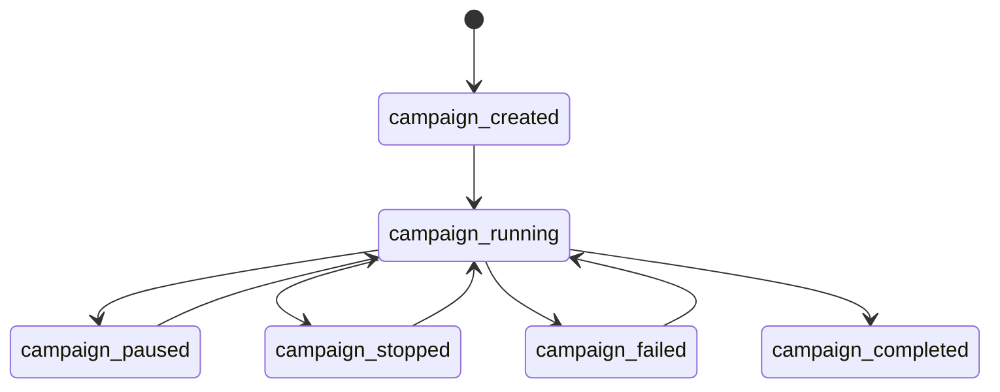
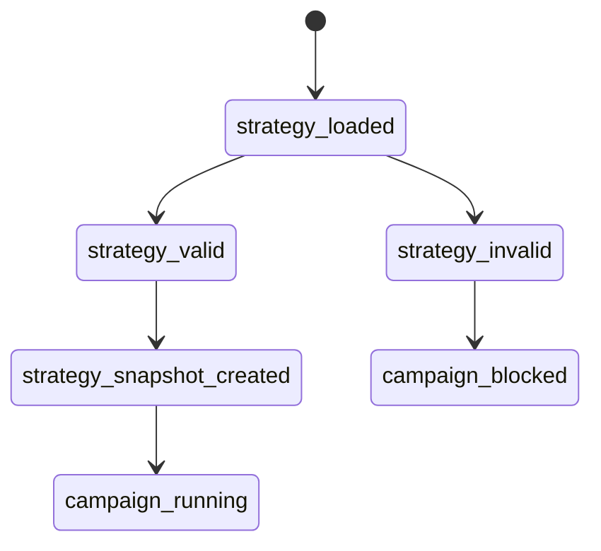
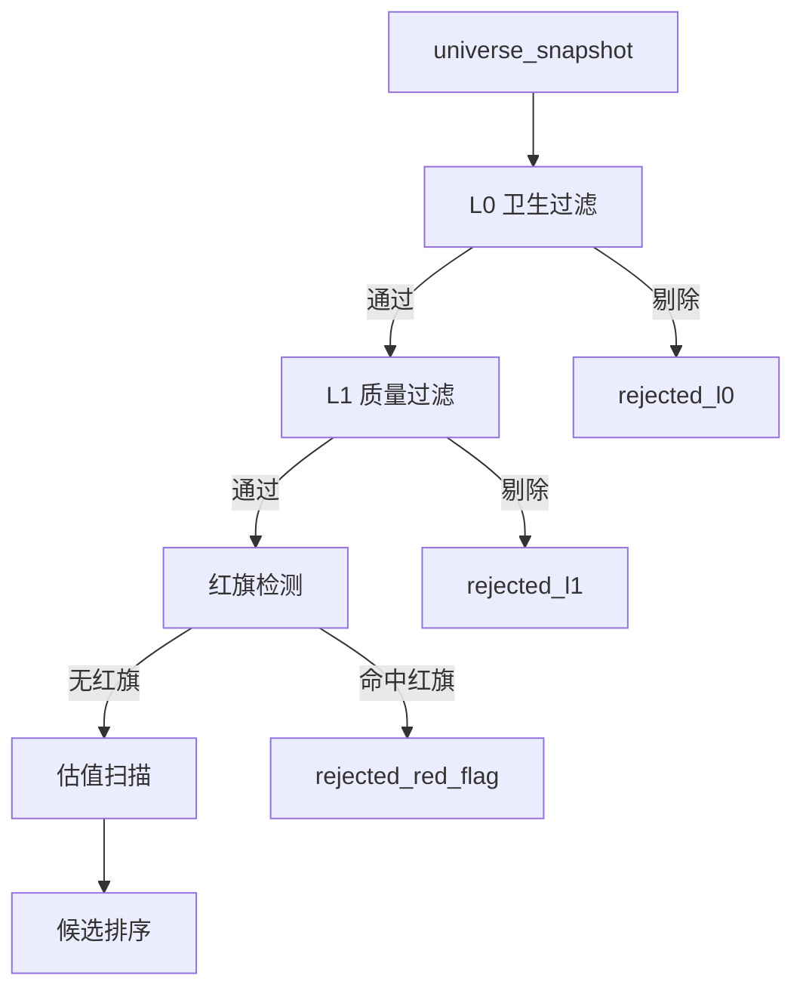
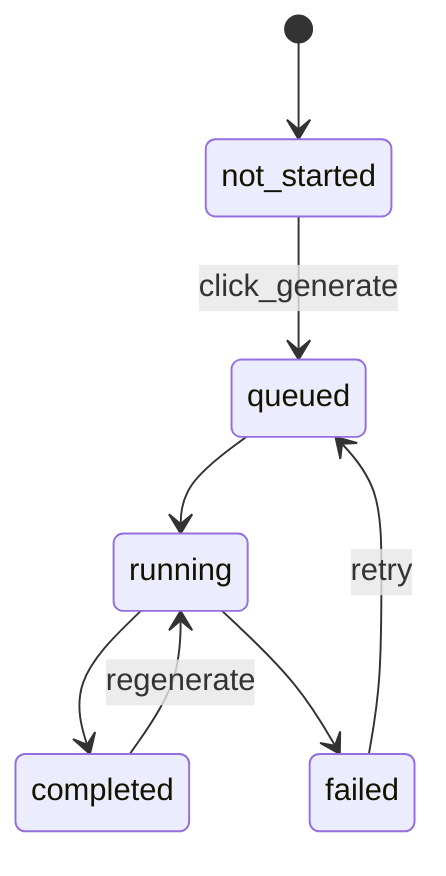

# AI Value Investor 季度批量扫描与筛选策略可视化 PRD

## 1. 背景 & 目标

当前系统可批量估值，但缺少季度全市场断点续扫、筛选策略可视化、暂停继续、行级研报状态、鲁棒失败兜底。  
目标用户是每季度使用本地系统扫描 A 股和港股的价值投资研究用户。  
目标支持单批最多 500 只，跨天完成全市场扫描，服务重启后 100% 恢复进度。  
目标让用户在前端可视化看到筛选策略、每条规则阈值、通过数、剔除数、失败原因。  
目标把低估候选到完整研报的路径控制在 2 次点击内完成。

---

## 2. 名词解释

| 名词 | 定义 |
|---|---|
| scan_campaign | 一个季度级扫描计划，记录扫描范围、股票池快照、进度、状态、结果文件 |
| scan_batch | scan_campaign 下的单批扫描任务，单批最多 500 只 |
| universe_snapshot | 创建扫描计划时固化的股票池列表，后续续扫不因股票库刷新而漂移 |
| screening_strategy | 筛选策略配置，包含 L0 卫生过滤、L1 质量过滤、红旗规则、估值规则 |
| strategy_inspector | 前端筛选策略详情页，用于展示规则、阈值、命中数量、剔除原因 |
| l0_hygiene_filter | 估值前的硬性基础过滤，剔除不适合普通价值投资框架的标的 |
| l1_quality_filter | 对盈利质量、现金含量、杠杆、毛利率、股本摊薄进行质量过滤 |
| red_flag | 造假或治理风险信号，任一命中直接出局 |
| master_result | 一个 scan_campaign 持续累积的主结果表 |
| filter_status | 单标的筛选状态，如 passed、rejected、manual_review、failed |
| reject_reason | 单标的被剔除的结构化原因 |
| report_job | 单个标的的完整研报生成任务 |
| report_button_state | 最近估值扫描表格中每个标的研报按钮状态 |

---

## 3. 用户场景

### 3.1 用户角色

| 角色 | 核心目标 |
|---|---|
| 投资研究用户 | 每季度可靠扫描全市场并筛出低估候选 |
| 策略检查用户 | 看清楚系统为什么剔除或保留某个标的 |
| 数据源配置用户 | 确认 Tushare、LLM、缓存、刷新策略是否可用 |
| 研报阅读用户 | 对低估候选一键生成并阅读完整研报 |
| 系统维护用户 | 查看失败原因、恢复任务、导出结果 |

### 3.2 用户流程

#### 3.2.1 季度扫描主流程

```text
打开本地控制台
→ 系统加载最近 scan_campaign
→ 用户选择扫描范围
→ 用户选择 screening_strategy
→ 用户选择 resume_mode
→ 系统创建或恢复 universe_snapshot
→ 系统拆分 scan_batch
→ 执行 L0 卫生过滤
→ 执行 L1 质量过滤
→ 执行红旗检测
→ 执行估值扫描
→ 写入 master_result
→ 更新可视化进度
→ campaign_completed
```

失败分支：

```text
执行扫描
→ 数据源失败
→ 标的级 failed
→ 连续失败超过阈值
→ campaign_paused
→ 用户查看错误
→ 用户选择 retry_failed 或 continue_remaining
```

#### 3.2.2 筛选策略查看流程

```text
打开策略详情
→ 系统读取 screening_strategy
→ 展示规则漏斗
→ 展示每条规则阈值
→ 展示当前 campaign 命中数量
→ 用户点击某条规则
→ 展示被剔除标的列表
→ 用户点击单个标的
→ 展示该标的规则判定明细
```

#### 3.2.3 暂停 / 停止 / 继续状态流

```text
campaign_running
→ 用户点击暂停
→ current_ticker_finished
→ campaign_paused
→ 用户点击继续
→ campaign_running
```

```text
campaign_running
→ 用户点击停止
→ current_ticker_finished_or_timeout
→ campaign_stopped
→ 用户选择继续原计划
→ campaign_running
```

#### 3.2.4 研报生成状态流

```text
report_not_started
→ 点击生成研报
→ report_queued
→ report_running
→ report_completed
→ 点击打开阅读
```

失败分支：

```text
report_running
→ LLM API 失败 / 数据不足 / 网络失败
→ report_failed
→ 用户点击查看详情
→ 用户点击重试
→ report_running
```

---

## 4. 功能需求

本需求在现有本地控制台、`stock_universe`、`valuation_jobs`、`valuation_scans`、报告阅读页基础上继续开发。  
核心改动是把“单次估值扫描”升级为“季度扫描计划 + 策略漏斗 + 可续扫批次 + 可解释筛选”。  
筛选策略必须前端可见，且每只标的必须能追溯到通过或剔除的具体规则。  
所有可视化优先用卡片、进度条、漏斗、状态色、规则表、单标的判定明细呈现。  
MVP 优先复用 SQLite、JSON、CSV、本地 HTML 控制台，不引入大型前端框架。

### 4.1 功能列表

| 优先级 | 模块 | 功能 |
|---|---|---|
| P0 | 季度扫描 | scan_campaign 分批续扫工作台 |
| P0 | 筛选策略 | 策略详情与筛选漏斗可视化 |
| P0 | 筛选逻辑 | L0 卫生过滤、L1 质量过滤、红旗直接出局 |
| P1 | 扫描控制 | 暂停、停止、继续、重试失败 |
| P1 | 研报生成 | 最近估值扫描行级研报状态 |
| P1 | 配置中心 | true/false 配置 toggle 化 |
| P1 | 结果管理 | campaign master_result 累积导出 |
| P2 | 鲁棒兜底 | 数据源、LLM、网络失败可视化处理 |
| P2 | 历史追踪 | 季度扫描历史对比 |
| P2 | 阅读体验 | 研报阅读页关联扫描来源 |

---

## 4.2 功能明细

## Feature: scan_campaign 分批续扫工作台

### 1. 描述

支持按季度创建全市场扫描计划，并按批次持续扫描，服务重启后可继续。

### 2. 功能详细说明

#### 2.1 功能交互说明

1. **系统 / 页面初始化**
   - 页面加载时读取最近一个 scan_campaign。
   - 若存在未完成 campaign，展示恢复提示。
   - 若不存在 campaign，展示创建扫描计划表单。
   - 默认批次大小为 100，最大 500。
   - 默认扫描阶段关闭 LLM。
   - 默认启用 `skip_scanned=true`，避免同一 campaign 内重复扫描。

2. **详细交互逻辑**
   - **与已有功能的交互关系：**
     - 复用 `stock_universe` 作为 A 股股票池来源。
     - 复用现有估值扫描逻辑生成单标的结果。
     - 复用 `valuation_scans` 输出 CSV/JSON。
   - **与交互界面的关系：**
     - 首页新增“季度扫描工作台”。
     - 使用进度条、批次卡片、状态色展示扫描状态。
   - **新增功能的交互逻辑：**
     - 用户选择扫描范围：`a_share`、`hk`、`a_share_hk`。
     - 用户选择 resume_mode：
       - `continue_last`
       - `restart_new`
       - `scan_remaining`
       - `retry_failed`
     - 系统创建 universe_snapshot。
     - 系统将 universe_snapshot 拆成 scan_batch。
     - 每完成一只标的，更新 completed_count、remaining_count、failed_count。

#### 可视化原型

```text
┌──────────────────────────────────────────────┐
│ 2026Q3 A股季度扫描                            │
│ 状态: running                                 │
│                                              │
│ 5529 总数  |  1300 已完成  |  12 失败        │
│ ███████████░░░░░░░░░░░ 23.5%                 │
│                                              │
│ 当前批次: 第 5 批 / 共 19 批                  │
│ 当前标的: 002236.SZ 大华股份                  │
│ 当前阶段: L1 质量过滤                         │
│                                              │
│ [暂停] [停止] [继续] [重试失败] [导出当前结果] │
└──────────────────────────────────────────────┘
```

#### 状态流



#### 2.2 功能数据说明

1. **数据流向**
   - 前端提交扫描范围、批次大小、resume_mode、screening_strategy_id。
   - 后端生成 universe_snapshot。
   - 后端创建 scan_campaign。
   - 后端拆分 scan_batch。
   - 单标的依次经过 L0、L1、红旗、估值流程。
   - 结果写入 master_result。
   - 前端轮询读取 campaign 状态并刷新可视化进度。

核心字段：

| 字段 | 说明 |
|---|---|
| campaign_id | 季度扫描计划 ID |
| campaign_name | 扫描计划名称 |
| quarter | 季度标签 |
| market_scope | 扫描范围 |
| strategy_id | 筛选策略 ID |
| total_count | 股票池总数 |
| completed_count | 已完成数 |
| failed_count | 失败数 |
| skipped_count | 跳过数 |
| rejected_count | 筛选剔除数 |
| remaining_count | 剩余数 |
| batch_size | 单批数量 |
| status | campaign 状态 |
| current_batch_id | 当前批次 ID |
| current_ticker | 当前标的 |
| resume_mode | 续扫模式 |

#### 2.3 功能适配

1. **多语言适配**
   - MVP 仅中文。
   - 所有状态值内部使用英文枚举，页面显示中文。

2. **亮暗模式适配**
   - MVP 保持当前浅色。
   - 颜色变量预留 dark mode token：background、panel、text、muted、accent、danger。

### 3. 原型图

本 PRD 内低保真原型。

### 4. 边界情况

- 空数据：股票池为空时显示“请先刷新股票库”。
- 权限不足：Tushare key 缺失时阻止创建全市场扫描。
- 异常失败：连续失败超过阈值时自动暂停 campaign。
- 服务重启：重新读取最近 campaign，展示“继续扫描”。
- 重复扫描：默认跳过同一 campaign 已完成 ticker。
- 批次过大：超过 500 时自动拦截并提示。

---

## Feature: 策略详情与筛选漏斗可视化

### 1. 描述

新增前端“筛选策略详情”页面，展示当前扫描使用的全部筛选规则、阈值、数据来源、命中数量、剔除原因。

### 2. 功能详细说明

#### 2.1 功能交互说明

1. **系统 / 页面初始化**
   - 页面加载当前默认 screening_strategy。
   - 若存在运行中 campaign，加载该 campaign 的策略快照。
   - 若没有运行中 campaign，加载系统默认策略。
   - 页面顶部展示策略状态：
     - strategy_id
     - strategy_name
     - version
     - last_updated_at
     - used_by_campaign_id

2. **详细交互逻辑**
   - **与已有功能的交互关系：**
     - 读取现有 `config/screening_rules.yaml`。
     - 读取 valuation_scan 输出里的 action、quality_score、data_completeness。
     - 新增 L0/L1/red_flag 的结构化判定结果。
   - **与交互界面的关系：**
     - 首页提供“查看筛选策略”入口。
     - campaign 详情页提供“查看本次策略快照”入口。
     - 单标的详情页展示该 ticker 的规则判定路径。
   - **新增功能的交互逻辑：**
     - 用户点击漏斗某层，展示该层通过和剔除数量。
     - 用户点击某条规则，展示命中该规则的 ticker 列表。
     - 用户点击 ticker，展示该 ticker 所有规则输入值、阈值、结果。

#### 策略漏斗原型

```text
┌─────────────────────────────┐
│ 初始股票池 5529              │
└──────────────┬──────────────┘
               ↓
┌─────────────────────────────┐
│ L0 卫生过滤  4021 通过       │
│ 剔除: ST 138 / 次新 712 / 金融地产 658 │
└──────────────┬──────────────┘
               ↓
┌─────────────────────────────┐
│ L1 质量过滤  860 通过        │
│ 剔除: ROE 低 1540 / 现金含量低 920 │
└──────────────┬──────────────┘
               ↓
┌─────────────────────────────┐
│ 红旗过滤  650 通过           │
│ 剔除: 商誉高 80 / 质押高 46 / 应收异常 84 │
└──────────────┬──────────────┘
               ↓
┌─────────────────────────────┐
│ 估值扫描  650                │
│ 候选: strong 12 / deep 41 / watch 120 │
└─────────────────────────────┘
```

#### 单规则卡片原型

```text
┌────────────────────────────────────────┐
│ 规则: 近5年 ROE 均 > 12%               │
│ 层级: L1 盈利质量                       │
│ 状态: 启用                              │
│ 数据源: fina_indicator.roe              │
│ 当前通过: 1320                          │
│ 当前剔除: 2140                          │
│ 数据缺失: 216                           │
│ [查看剔除标的] [查看缺失数据]            │
└────────────────────────────────────────┘
```

#### 单标的判定明细原型

```text
002236.SZ 大华股份

L0 卫生过滤
✓ 非 ST
✓ 上市满 5 年
✓ 非金融地产
? 审计意见数据缺失

L1 质量过滤
✓ 近5年 ROE 均值 17.2%，全部 > 12%
✓ 所有者收益 5年累计 / 净利 = 82%
✗ 销售收现 / 营收 近3年最低 78%，低于 85%

最终: rejected
主因: 现金含量不足
```

#### 策略状态流



#### 2.2 功能数据说明

1. **数据流向**
   - 配置文件读取 screening_strategy。
   - campaign 创建时复制当前 strategy 为 strategy_snapshot。
   - 单标的扫描时产生 rule_evaluation。
   - rule_evaluation 写入 master_result 和详情 JSON。
   - 前端读取 campaign 级聚合统计和 ticker 级明细。

核心字段：

| 字段 | 说明 |
|---|---|
| strategy_id | 策略 ID |
| strategy_name | 策略名称 |
| strategy_version | 策略版本 |
| rule_id | 规则 ID |
| rule_layer | l0 / l1 / red_flag / valuation |
| rule_name | 规则名称 |
| enabled | 是否启用 |
| threshold | 阈值 |
| data_source | 数据来源 |
| pass_count | 通过数量 |
| reject_count | 剔除数量 |
| missing_count | 数据缺失数量 |
| rule_result | pass / reject / missing / manual_review |

#### 2.3 功能适配

1. **多语言适配**
   - MVP 仅中文。
   - 内部字段使用英文枚举。

2. **亮暗模式适配**
   - 规则状态颜色使用 success、warning、danger、muted。

### 3. 原型图

本 PRD 内低保真原型。

### 4. 边界情况

- 策略配置缺失：加载系统内置默认策略。
- 策略配置格式错误：阻止 campaign 创建，并展示错误行。
- 某条规则数据源不可用：该规则显示 missing_count，不默认为通过。
- 规则阈值为空：该规则自动禁用并提示。
- campaign 已开始后修改策略：不影响当前 campaign，只影响新 campaign。

---

## Feature: L0 卫生过滤、L1 质量过滤、红旗直接出局

### 1. 描述

在估值扫描前新增分层筛选评估逻辑，先剔除不适合普通价值投资框架的标的，再进入估值排序。

### 2. 功能详细说明

#### 2.1 功能交互说明

1. **系统 / 页面初始化**
   - 默认启用 `l0_hygiene_filter=true`。
   - 默认启用 `l1_quality_filter=true`。
   - 默认启用 `red_flag_filter=true`。
   - 默认启用 `financial_real_estate_exclusion=true`。
   - 页面显示各层规则是否启用。

2. **详细交互逻辑**
   - **与已有功能的交互关系：**
     - 现有估值扫描仍保留。
     - 新增筛选层在估值前执行。
     - 被 L0/L1/red_flag 剔除的标的不进入估值计算，或仅保存基础剔除结果。
   - **与交互界面的关系：**
     - 最近估值扫描表格新增 filter_status、reject_reason。
     - 策略详情页展示每层规则通过率。
   - **新增功能的交互逻辑：**
     - L0 命中硬剔除，状态为 rejected。
     - L1 任一关键质量项不满足，状态为 rejected 或 manual_review。
     - 任一 red_flag 命中，状态为 rejected。
     - 数据缺失按规则重要性处理：
       - L0 核心字段缺失：manual_review，不进入候选池。
       - red_flag 数据缺失：记录 data_gap，降低 confidence，不直接通过。
       - 多个关键字段缺失：rejected_missing_data。

#### 分层扫描流程



#### L0 卫生过滤规则

| rule_id | 筛选项 | 规则 | 默认动作 | 数据来源 |
|---|---|---|---|---|
| l0_non_st | ST/*ST | 名称包含 ST、*ST、退，直接剔除 | rejected_l0 | stock_basic.name |
| l0_listing_age | 上市年限 | 上市不满 5 年直接剔除 | rejected_l0 | stock_basic.list_date |
| l0_audit_opinion | 审计意见 | 非标准无保留意见直接剔除 | rejected_l0 | fina_audit |
| l0_industry_exclusion | 金融地产 | 银行、保险、券商、地产、类金融单独剔除 | rejected_l0 | stock_basic.industry |

#### L1 质量过滤规则

| rule_id | 筛选项 | 规则 | 默认动作 | 数据来源 |
|---|---|---|---|---|
| l1_roe_5y | 盈利质量 | 近 5 年 ROE 均 > 12% | rejected_l1 | fina_indicator.roe |
| l1_owner_earnings | 所有者收益 | 扣非净利 + 折旧摊销 - 资本开支，近 5 年均为正且 5 年累计 / 净利 > 70% | rejected_l1 | income / cashflow |
| l1_cash_collection | 现金含量 | 销售商品收现 / 营收，近 3 年均 > 85% | rejected_l1 | cashflow / income |
| l1_leverage | 杠杆 | 有息负债 / 净资产 < 50%，剔除类金融 | rejected_l1 | balancesheet |
| l1_gross_margin | 毛利率 | 5 年毛利率绝对值 > 25%，且标准差低于行业阈值 | rejected_l1 | fina_indicator |
| l1_share_dilution | 摊薄记录 | 5 年股本 CAGR < 3% | rejected_l1 | share_float / income.total_share |

#### 红旗规则

| rule_id | 红旗类型 | 规则 | 默认动作 | 数据来源 |
|---|---|---|---|---|
| rf_cash_debt_double_high | 存货双高扩展 | 货币资金 > 净资产 40%，同时有息负债 > 净资产 30% | rejected_red_flag | balancesheet |
| rf_receivable_surge | 应收激增 | 应收账款 / 营收显著上升，且增速超过营收增速阈值 | rejected_red_flag | balancesheet / income |
| rf_other_receivable | 其他应收款异常 | 其他应收款 / 净资产超过阈值 | rejected_red_flag | balancesheet |
| rf_goodwill_high | 商誉过高 | 商誉 / 净资产 > 30% | rejected_red_flag | balancesheet |
| rf_pledge_high | 大股东质押 | 大股东质押比例 > 50% | rejected_red_flag | pledge_stat |
| rf_investigation | 频繁立案 | 近 3 年多次被立案或处罚 | rejected_red_flag | announcement / news / manual_flag |

#### 前端结果列

| 字段 | 示例 | 说明 |
|---|---|---|
| filter_status | rejected_red_flag | 筛选状态 |
| filter_layer | red_flag | 出局层级 |
| reject_reason | 商誉/净资产 38% > 30% | 主剔除原因 |
| failed_rules | rf_goodwill_high | 失败规则 |
| missing_rules | l0_audit_opinion | 数据缺失规则 |
| rule_score | 82 | 非硬剔除规则得分 |

#### 2.2 功能数据说明

1. **数据流向**
   - Tushare 和本地 SQLite 提供财务数据。
   - 筛选引擎读取近 5 年年报和近 3 年现金流数据。
   - 每条规则生成 rule_evaluation。
   - 单标的聚合为 filter_result。
   - master_result 保存 filter_result 和 valuation_result。
   - 前端按 filter_status 做漏斗和表格展示。

核心字段：

| 字段 | 说明 |
|---|---|
| ticker | 标的代码 |
| rule_id | 规则 ID |
| rule_layer | l0 / l1 / red_flag |
| input_value | 实际值 |
| threshold_value | 阈值 |
| result | pass / reject / missing / manual_review |
| severity | hard / warning / info |
| reason | 结构化原因 |
| data_source | 数据来源 |
| period_range | 使用周期 |

#### 2.3 功能适配

1. **多语言适配**
   - MVP 仅中文。

2. **亮暗模式适配**
   - pass 用绿色，reject 用红色，missing 用黄色，manual_review 用蓝色。

### 3. 原型图

```text
┌─────────────────────────────────────────────────────┐
│ 筛选结果: 002236.SZ 大华股份                         │
├──────────────┬──────────────┬──────────────┬────────┤
│ 层级          │ 规则          │ 判定          │ 原因    │
├──────────────┼──────────────┼──────────────┼────────┤
│ L0            │ 非ST          │ ✓ pass        │ -      │
│ L0            │ 上市满5年      │ ✓ pass        │ 2008上市│
│ L1            │ 5年ROE        │ ✓ pass        │ 最低13.5%│
│ L1            │ 现金含量       │ ✗ reject      │ 最低78% │
│ 红旗           │ 商誉/净资产    │ ✓ pass        │ 12%    │
└──────────────┴──────────────┴──────────────┴────────┘
```

### 4. 边界情况

- 上市日期缺失：标记 manual_review，不进入候选池。
- 审计意见缺失：标记 manual_review，不进入 strong_candidate。
- 金融地产：从普通策略剔除，可后续进入单独策略。
- pledge_stat 缺失：记录 governance_data_gap，降低 confidence。
- announcement 数据缺失：立案规则显示 missing，不直接判为 pass。
- 新股不足 5 年：直接 rejected_l0。
- 行业毛利率阈值缺失：使用默认 25%，并显示“使用默认阈值”。
- 负净资产：直接 rejected_l0 或 manual_review。
- 数据单位异常：触发 data_quality_flag，不进入候选池。

---

## Feature: 暂停、停止、继续、重试失败

### 1. 描述

支持用户安全中断扫描，并从断点继续或只重试失败标的。

### 2. 功能详细说明

#### 2.1 功能交互说明

1. **系统 / 页面初始化**
   - 若 campaign 状态为 `running` 且超过 10 分钟未更新，显示“疑似中断”。
   - 若 campaign 状态为 `paused`，显示继续按钮。
   - 若 campaign 状态为 `failed`，显示继续和重试失败按钮。

2. **详细交互逻辑**
   - **与已有功能的交互关系：**
     - 复用现有 job 状态文件。
     - 保留现有 scan 输出文件。
   - **与交互界面的关系：**
     - 扫描工作台展示控制按钮。
     - 按钮状态随 campaign status 变化。
   - **新增功能的交互逻辑：**
     - 暂停：当前 ticker 完成后暂停。
     - 停止：当前 ticker 完成或超时后停止。
     - 继续：从第一个未完成 ticker 开始。
     - 重试失败：只扫描 status 为 `failed` 的 ticker。

#### 控制按钮状态

| campaign_status | 主按钮 | 次按钮 |
|---|---|---|
| running | 暂停 | 停止 |
| paused | 继续 | 重新开始 |
| stopped | 继续 | 重新开始 |
| failed | 继续 | 重试失败 |
| completed | 重新扫描 | 导出结果 |

#### 2.2 功能数据说明

1. **数据流向**
   - 前端点击控制按钮。
   - 后端更新 campaign control_flag。
   - 执行器在每只 ticker 完成后检查 control_flag。
   - 若暂停或停止，保存当前 cursor。
   - 前端刷新 campaign 状态。

核心字段：

| 字段 | 说明 |
|---|---|
| control_flag | none / pause_requested / stop_requested |
| cursor_index | 当前扫描位置 |
| last_completed_ticker | 最近完成标的 |
| next_ticker | 下一个标的 |
| retry_scope | failed_only / remaining_only / all |

#### 2.3 功能适配

1. **多语言适配**
   - MVP 仅中文。

2. **亮暗模式适配**
   - 暂停、停止、失败使用不同颜色 token。

### 3. 原型图

```text
运行中:
[暂停] [停止]

暂停中:
[继续扫描] [重新开始]

失败:
[继续扫描] [只重试失败项] [导出已完成结果]
```

### 4. 边界情况

- 用户连续点击暂停：只保留第一个 pause_requested。
- 用户停止后继续：从未完成 ticker 开始。
- 当前 ticker 卡死：超过单标的超时时间后标记 failed。
- 服务关闭：下次启动显示疑似中断并允许继续。
- LLM 欠费：自动记录错误并暂停需要 LLM 的任务。

---

## Feature: 最近估值扫描行级研报状态

### 1. 描述

最近估值扫描表格中的“生成研报”按钮展示每个标的的研报生成状态。

### 2. 功能详细说明

#### 2.1 功能交互说明

1. **系统 / 页面初始化**
   - 首页加载最近估值扫描结果。
   - 系统同时读取 report_job 状态。
   - 系统按 ticker 映射每行按钮状态。

2. **详细交互逻辑**
   - **与已有功能的交互关系：**
     - 复用现有完整研报生成逻辑。
     - 复用现有 `/report-job` 详情页。
     - 复用 `/reports/{file_name}` 阅读页。
   - **与交互界面的关系：**
     - 默认不跳转详情页。
     - 点击生成后按钮在当前行变为加载态。
     - hover 时显示“查看详情”。
   - **新增功能的交互逻辑：**
     - `not_started`：按钮文案“生成研报”。
     - `queued`：按钮文案“排队中”。
     - `running`：按钮文案“生成中”并展示 spinner。
     - `completed`：按钮文案“已完成”，点击打开报告。
     - `failed`：按钮文案“生成失败”，点击进入详情。

#### 按钮状态图



#### 2.2 功能数据说明

1. **数据流向**
   - 点击按钮后前端提交 ticker、name、market、scan_id。
   - 后端创建 report_job。
   - report_job 状态持久化。
   - 前端轮询 report_job。
   - 生成完成后写入 report_path、report_url。
   - 按钮切换为 completed。

核心字段：

| 字段 | 说明 |
|---|---|
| report_job_id | 研报任务 ID |
| ticker | 标的代码 |
| name | 中文名 |
| source_scan_id | 来源扫描 ID |
| status | report_job 状态 |
| progress_pct | 进度 |
| report_path | 本地报告路径 |
| report_url | 前端阅读链接 |
| error | 错误信息 |

#### 2.3 功能适配

1. **多语言适配**
   - MVP 仅中文。

2. **亮暗模式适配**
   - 按钮状态使用统一颜色 token。

### 3. 原型图

```text
┌───────────┬──────┬──────┬────────┬────────────┐
│ 代码       │ 名称 │ 安全边际 │ 动作   │ 研报        │
├───────────┼──────┼──────┼────────┼────────────┤
│ 002236.SZ │ 大华股份 │ 35.2% │ deep_research │ 生成中 ⟳ │
│ 000977.SZ │ 浪潮信息 │ 4.3%  │ watch         │ 已完成   │
└───────────┴──────┴──────┴────────┴────────────┘
```

### 4. 边界情况

- 重复点击生成：已有 running job 时不创建新任务。
- 报告已存在：按钮直接显示 completed。
- 报告文件丢失：按钮显示 failed，并提示文件不存在。
- LLM 欠费：report_job 进入 failed，保留错误详情。
- 服务重启：从持久化 report_job 恢复按钮状态。

---

## Feature: true/false 配置 toggle 化

### 1. 描述

将所有布尔配置项改成前端 toggle，并支持点击后保存配置。

### 2. 功能详细说明

#### 2.1 功能交互说明

1. **系统 / 页面初始化**
   - 设置页读取 `.env` 和当前进程配置。
   - 布尔配置显示为 toggle。
   - API Key 继续使用输入框。

2. **详细交互逻辑**
   - **与已有功能的交互关系：**
     - 复用现有设置保存逻辑。
     - 复用现有 `.env` 备份逻辑。
   - **与交互界面的关系：**
     - toggle 开为绿色。
     - toggle 关为灰色。
     - 需要重启的配置显示提示。
   - **新增功能的交互逻辑：**
     - 点击 toggle 后立即提交。
     - 后端写入 `.env`。
     - 后端同步 `os.environ`。
     - 页面刷新配置状态。

#### Toggle 列表

| 配置项 | 默认 | 是否立即生效 |
|---|---:|---|
| skip_akshare | true | 是 |
| tushare_disable_proxy | false | 是 |
| use_industry_engine_v3 | false | 是 |
| l0_hygiene_filter | true | 当前 campaign 生效 |
| l1_quality_filter | true | 当前 campaign 生效 |
| red_flag_filter | true | 当前 campaign 生效 |
| financial_real_estate_exclusion | true | 当前 campaign 生效 |
| db_auto_maintenance | true | 是 |
| scan_refresh_data | false | 当前任务创建时生效 |
| scan_use_llm | false | 当前任务创建时生效 |
| include_risk | false | 当前任务创建时生效 |
| skip_scanned | true | 当前 campaign 生效 |
| force_rescan | false | 当前 campaign 生效 |
| retry_failed_only | false | 当前 campaign 生效 |

#### 2.2 功能数据说明

1. **数据流向**
   - 前端 toggle 发送 key、value。
   - 后端校验 key 是否允许保存。
   - 后端写入 `.env`。
   - 后端刷新当前配置快照。
   - 前端展示保存成功或失败。

核心字段：

| 字段 | 说明 |
|---|---|
| config_key | 配置名称 |
| config_value | true / false |
| effective_scope | immediate / next_task / restart_required |
| saved_at | 保存时间 |

#### 2.3 功能适配

1. **多语言适配**
   - MVP 仅中文。

2. **亮暗模式适配**
   - toggle 使用 CSS token。

### 3. 原型图

```text
┌──────────────────────────────┐
│ 配置中心                       │
│ SKIP_AKSHARE          ON  ●   │
│ TUSHARE_DISABLE_PROXY OFF ○   │
│ L0卫生过滤             ON  ●   │
│ 红旗直接出局           ON  ●   │
│ 跳过已扫描标的         ON  ●   │
└──────────────────────────────┘
```

### 4. 边界情况

- 配置保存失败：恢复原 toggle 状态。
- `.env` 不存在：创建 `.env` 并写入。
- 非白名单 key：拒绝保存。
- 需要重启项：显示“下次启动生效”。

---

## Feature: campaign master_result 累积导出

### 1. 描述

每个 scan_campaign 维护一份持续累积的主结果表。

### 2. 功能详细说明

#### 2.1 功能交互说明

1. **系统 / 页面初始化**
   - campaign 页面加载 master_result 摘要。
   - 显示候选数量、筛选剔除数量、失败数量、已完成数量。

2. **详细交互逻辑**
   - **与已有功能的交互关系：**
     - 复用当前 valuation_scan CSV 字段。
   - **与交互界面的关系：**
     - 页面提供“导出当前结果”按钮。
     - 页面提供“导出筛选剔除明细”按钮。
   - **新增功能的交互逻辑：**
     - 每完成一只 ticker，更新 master_result。
     - 同一 campaign 内重扫 ticker 时覆盖最新结果。
     - 历史结果保留在 batch 明细中。

#### 2.2 功能数据说明

字段：

| 字段 | 说明 |
|---|---|
| campaign_id | 扫描计划 ID |
| ticker | 标的代码 |
| name | 中文名 |
| market | 市场 |
| filter_status | 筛选状态 |
| filter_layer | 出局层级 |
| reject_reason | 剔除原因 |
| current_price | 当前价格 |
| intrinsic_value | 内在价值 |
| margin_of_safety_pct | 安全边际 |
| action | 操作建议 |
| confidence | 置信度 |
| quality_score | 数据质量 |
| data_completeness | 数据完整度 |
| scan_status | success / failed / skipped |
| scanned_at | 扫描时间 |
| batch_id | 批次 ID |
| error | 错误信息 |

#### 2.3 功能适配

1. **多语言适配**
   - CSV 表头 MVP 保持英文 snake_case。

2. **亮暗模式适配**
   - 表格支持局部横向滚动。

### 3. 原型图

```text
[导出当前结果] [导出候选池] [导出筛选剔除明细] [导出失败项]
```

### 4. 边界情况

- 文件被占用：写入临时文件，提示用户关闭文件后重试。
- 中途停止：导出已完成结果。
- 空结果：导出按钮置灰。

---

## Feature: 数据源、LLM、网络失败可视化处理

### 1. 描述

对关键失败进行分类展示，并给出可执行恢复动作。

### 2. 功能详细说明

#### 2.1 功能交互说明

1. **系统 / 页面初始化**
   - 首页显示系统健康状态。
   - campaign 页面显示最近失败原因。

2. **详细交互逻辑**
   - **与已有功能的交互关系：**
     - 复用 Tushare health check。
     - 复用 API Key 状态展示。
   - **与交互界面的关系：**
     - 使用红黄绿状态卡。
   - **新增功能的交互逻辑：**
     - 数据源失败：允许继续扫描，但标的记录 failed。
     - LLM 失败：扫描阶段若未启用 LLM 不受影响。
     - 研报阶段 LLM 失败：report_job failed。
     - 连续失败超过阈值：campaign 自动暂停。

#### 失败分类

| failure_type | 展示文案 | 可执行动作 |
|---|---|---|
| data_source_timeout | 数据源超时 | 重试失败项 |
| tushare_auth_failed | Tushare 认证失败 | 打开配置 |
| llm_auth_failed | LLM 认证失败 | 打开配置 |
| llm_quota_failed | LLM 额度不足 | 关闭 LLM 或更换 Key |
| local_db_locked | 本地数据库被占用 | 稍后重试 |
| report_file_missing | 报告文件不存在 | 重新生成 |
| screening_data_missing | 筛选关键数据缺失 | 查看缺失数据 |

#### 2.2 功能数据说明

核心字段：

| 字段 | 说明 |
|---|---|
| failure_type | 失败类型 |
| failure_scope | ticker / batch / campaign / report_job |
| retryable | 是否可重试 |
| user_action | 建议动作 |
| raw_error | 原始错误摘要 |

#### 2.3 功能适配

1. **多语言适配**
   - MVP 仅中文。

2. **亮暗模式适配**
   - failure_type 使用 danger、warning、success token。

### 3. 原型图

```text
┌──────────────┬──────────────┬────────────┐
│ 错误类型       │ 影响范围       │ 操作        │
├──────────────┼──────────────┼────────────┤
│ LLM额度不足    │ 研报任务       │ 打开配置     │
│ Tushare超时    │ 3只标的        │ 重试失败项   │
│ 审计意见缺失    │ 216只标的      │ 查看缺失数据 │
└──────────────┴──────────────┴────────────┘
```

### 4. 边界情况

- 错误无分类：归类为 unknown_error。
- 错误信息过长：前端展示摘要，详情页展示完整文本。
- 连续失败：自动暂停，避免无限请求。
- 关键筛选数据缺失：进入 manual_review，不进入强候选。

---

## Feature: 季度扫描历史对比

### 1. 描述

展示不同季度扫描计划的完成情况和候选数量变化。

### 2. 功能详细说明

#### 2.1 功能交互说明

1. **系统 / 页面初始化**
   - 读取历史 campaign 列表。
   - 默认展示最近 4 个季度。

2. **详细交互逻辑**
   - **与已有功能的交互关系：**
     - 复用 valuation_scan 历史文件。
   - **与交互界面的关系：**
     - 使用趋势卡片展示。
   - **新增功能的交互逻辑：**
     - 用户选择季度。
     - 页面展示强候选、深研候选、watch、reject、filter_rejected 数量。

#### 2.2 功能数据说明

字段：

| 字段 | 说明 |
|---|---|
| quarter | 季度 |
| campaign_id | 扫描计划 ID |
| total_count | 总数 |
| completed_count | 完成数 |
| filter_rejected_count | 筛选剔除数 |
| strong_candidate_count | 强候选数 |
| deep_research_count | 深研候选数 |
| failed_count | 失败数 |

#### 2.3 功能适配

1. **多语言适配**
   - MVP 仅中文。

2. **亮暗模式适配**
   - 趋势图使用 CSS token。

### 3. 原型图

```text
2026Q1  ███████░  83%  候选 12  筛除 3820
2026Q2  ████████ 100%  候选 18  筛除 4100
2026Q3  ███░░░░░  35%  候选 7   筛除 1200
```

### 4. 边界情况

- 无历史：展示空状态。
- 历史文件损坏：跳过该文件并提示。
- 口径不同：展示扫描范围和过滤条件。

---

## Feature: 研报阅读页关联扫描来源

### 1. 描述

研报阅读页显示该报告来自哪个扫描结果、哪个 campaign、哪个筛选策略。

### 2. 功能详细说明

#### 2.1 功能交互说明

1. **系统 / 页面初始化**
   - 打开报告页时读取 report_job。
   - 如果有关联 scan_id，展示来源信息。

2. **详细交互逻辑**
   - **与已有功能的交互关系：**
     - 复用 `/reports/{file_name}`。
   - **与交互界面的关系：**
     - 报告顶部显示来源卡片。
   - **新增功能的交互逻辑：**
     - 点击来源可回到估值详情。
     - 点击 campaign 可回到季度扫描工作台。
     - 点击 strategy 可回到策略详情页。

#### 2.2 功能数据说明

字段：

| 字段 | 说明 |
|---|---|
| report_path | 报告路径 |
| source_scan_id | 来源 scan |
| source_campaign_id | 来源 campaign |
| source_strategy_id | 来源筛选策略 |
| source_ticker | 标的代码 |
| generated_at | 生成时间 |

#### 2.3 功能适配

1. **多语言适配**
   - MVP 仅中文。

2. **亮暗模式适配**
   - 来源卡片适配浅色和暗色。

### 3. 原型图

```text
报告来源
Campaign: 2026Q3 A股全市场
Scan: 20260717_153000
Strategy: buffett_quality_v1
Ticker: 002236.SZ 大华股份
[返回估值详情] [返回季度扫描] [查看筛选策略]
```

### 4. 边界情况

- 找不到来源：隐藏来源卡片。
- source_scan_id 已删除：显示“来源扫描不存在”。
- 报告文件改名：通过 report_path 查找。

---

## 5. 非功能需求

### 5.1 运营需求

| 项目 | 要求 |
|---|---|
| 权限控制 | MVP 本地单用户，无登录 |
| 配置开关 | true/false 配置全部 toggle 化 |
| 数据导出 | campaign 支持导出 master_result、候选池、筛选剔除明细、失败项 |
| 任务恢复 | 服务重启后恢复 campaign 和 report_job 状态 |
| 策略可追溯 | 每个 campaign 固化 strategy_snapshot |
| 数据保留 | 历史 scan、campaign、report 文件默认保留 |
| 最大批次 | 单批最多 500 只 |
| 失败处理 | 标的级失败不阻断 campaign，连续失败触发暂停 |
| 文件路径 | 报告保存在 output 根目录 |

### 5.2 埋点需求

| 事件名 | 触发时机 | 字段 |
|---|---|---|
| campaign_create_click | 点击创建季度扫描 | campaign_id, market_scope, batch_size, strategy_id |
| campaign_resume_click | 点击继续扫描 | campaign_id, completed_count, remaining_count |
| campaign_pause_click | 点击暂停 | campaign_id, current_ticker |
| campaign_stop_click | 点击停止 | campaign_id, completed_count |
| strategy_view_click | 点击查看筛选策略 | strategy_id, campaign_id |
| strategy_rule_click | 点击单条规则 | strategy_id, rule_id |
| batch_start | 批次开始 | campaign_id, batch_id, batch_size |
| batch_complete | 批次完成 | campaign_id, batch_id, success_count, failed_count |
| ticker_filter_rejected | 单只标的被筛除 | campaign_id, ticker, rule_id, reject_reason |
| ticker_scan_complete | 单只标的估值完成 | campaign_id, ticker, action, confidence |
| ticker_scan_failed | 单只标的失败 | campaign_id, ticker, failure_type |
| report_generate_click | 点击生成研报 | ticker, name, source_scan_id |
| report_job_complete | 研报生成完成 | ticker, report_path |
| report_job_failed | 研报生成失败 | ticker, failure_type |
| config_toggle_change | 切换配置 | config_key, config_value |

---

## 6. 验收标准

### P0 Feature: scan_campaign 分批续扫工作台

```gherkin
Given 用户选择全 A 股并设置 batch_size 为 100
When 用户点击创建扫描计划
Then 系统创建 scan_campaign
And 显示 total_count、completed_count、remaining_count
And batch_size 等于 100
And 单批数量不超过 500
```

```gherkin
Given 已存在未完成 scan_campaign
When 用户重启本地控制台
Then 首页展示该 campaign 的完成数、剩余数、当前状态
And 用户可以点击继续扫描
```

```gherkin
Given 用户设置 batch_size 为 800
When 用户提交扫描计划
Then 系统拒绝创建
And 页面提示“单批最多 500 只”
And 响应时间小于 1 秒
```

### P0 Feature: 策略详情与筛选漏斗可视化

```gherkin
Given 用户打开筛选策略详情页
When 当前存在 campaign
Then 页面展示该 campaign 使用的 strategy_snapshot
And 页面展示 L0、L1、红旗、估值四层漏斗
And 每层展示通过数、剔除数、缺失数
```

```gherkin
Given 某条规则剔除了标的
When 用户点击该规则
Then 页面展示该规则剔除的 ticker 列表
And 每个 ticker 展示 reject_reason
```

```gherkin
Given 策略配置文件格式错误
When 用户创建 campaign
Then 系统阻止创建
And 页面展示配置错误
And 响应时间小于 2 秒
```

### P0 Feature: L0 卫生过滤、L1 质量过滤、红旗直接出局

```gherkin
Given 标的名称包含 ST
When 系统执行 L0 卫生过滤
Then filter_status 等于 rejected_l0
And reject_reason 包含 ST
And 该标的不进入估值扫描
```

```gherkin
Given 标的上市不满 5 年
When 系统执行 L0 卫生过滤
Then filter_status 等于 rejected_l0
And reject_reason 包含 上市不满5年
```

```gherkin
Given 标的商誉/净资产大于 30%
When 系统执行红旗检测
Then filter_status 等于 rejected_red_flag
And failed_rules 包含 rf_goodwill_high
And 该标的不进入候选池
```

```gherkin
Given 标的近 5 年 ROE 存在低于 12%
When 系统执行 L1 质量过滤
Then filter_status 等于 rejected_l1
And reject_reason 包含 ROE
```

```gherkin
Given 审计意见数据缺失
When 系统执行 L0 卫生过滤
Then filter_status 等于 manual_review
And missing_rules 包含 l0_audit_opinion
And 该标的不进入 strong_candidate
```

### P1 Feature: 暂停、停止、继续、重试失败

```gherkin
Given campaign_status 为 running
When 用户点击暂停
Then 系统将 control_flag 设置为 pause_requested
And 当前 ticker 完成后 campaign_status 变为 paused
And 页面在 5 秒内展示 paused
```

```gherkin
Given campaign_status 为 paused
When 用户点击继续
Then 系统从 next_ticker 开始扫描
And 已完成 ticker 不重复扫描
```

```gherkin
Given 某批次连续 10 只 ticker 数据源失败
When 系统检测到连续失败
Then campaign_status 变为 paused
And failure_type 显示为 data_source_timeout
And 页面展示“重试失败项”
```

### P1 Feature: 最近估值扫描行级研报状态

```gherkin
Given 最近估值扫描列表中某标的 report_button_state 为 not_started
When 用户点击生成研报
Then 按钮变为 running
And 当前页面不跳转
And hover 按钮显示“查看详情”
```

```gherkin
Given report_job 成功生成报告
When 首页刷新
Then 对应标的按钮显示 completed
And 点击按钮打开报告阅读页
And 报告路径存在于 output 根目录
```

```gherkin
Given LLM API 返回额度不足
When 用户生成研报
Then report_job_status 变为 failed
And 按钮显示“生成失败”
And 点击按钮进入详情页查看 failure_type
```

### P1 Feature: true/false 配置 toggle 化

```gherkin
Given 用户打开配置页
When 配置项为布尔值
Then 页面使用 toggle 展示
And 不展示文本输入框
```

```gherkin
Given 用户点击 l0_hygiene_filter toggle
When 后端保存成功
Then 配置写入新值
And 页面在 2 秒内刷新为新状态
```

### 全局响应时间

| 场景 | 标准 |
|---|---:|
| 首页加载 campaign 摘要 | 小于 2 秒 |
| 打开筛选策略详情页 | 小于 2 秒 |
| 打开单标的筛选明细 | 小于 2 秒 |
| 切换 toggle | 小于 2 秒 |
| 创建 campaign | 小于 3 秒 |
| 暂停请求响应 | 小于 2 秒 |
| 任务状态刷新 | 每 5 秒刷新一次 |
| 打开已有报告 | 小于 2 秒 |
| 导出已完成结果 | 5000 行内小于 5 秒 |

---

## 7. 全局约束规则

```text
1. 输出格式：Markdown
2. 结构极简
3. 不写市场分析
4. 不写竞品分析
5. 所有功能必须可直接开发
6. 所有字段必须结构化
7. 所有状态必须可枚举
8. 不使用模糊功能名
9. 字段命名使用 snake_case
10. MVP 优先复用现有 SQLite、JSON、CSV、本地控制台
11. 新建表或新增状态前，必须先复用现有 stock_universe、valuation_jobs、valuation_scans、report_job
12. 单批扫描最多 500 只
13. 任一标的失败不得阻断整个 campaign
14. 服务重启后必须可恢复 campaign 和 report_job
15. 所有关键结果必须可视化展示
16. 所有可操作状态必须提供明确按钮
17. 筛选策略必须前端可见
18. 每只标的必须可追溯通过或剔除的具体规则
19. 任一红旗规则命中必须直接出局
20. 策略缺失关键数据时不得默认为通过
```
